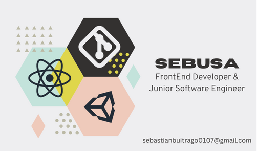

<!-- Header -->
<br />
<div align="center">
  <a href="https://github.com/Sebusa/">
    
  </a>

  <h3 align="center">Hi! I'm Sebastian!</h3>

  <p align="center">
    This is my github where you can see all my work 👀
    <br />
    <a href="#about">About Me</a>
    ·
    <a href="#tech">Tech Stack</a>
    ·
    <a href="#contact">Contact Me</a>
  </p>
</div>
_______________________________________________________________________________________________________________________________________________
<!-- Info -->

<div id="about">
  <h3 align="center"> 👨🏻‍💻 &nbsp;About Me </h3>

  - 🤔 &nbsp; I'm a computer science student and a junior software engineer.
  - 🎓 &nbsp; My alma mater is Universidad Tecnológica de Pereira.
  - 🌎 &nbsp; Although I'm a native spanish speaker, I can handle english pretty well.
  - 🔬 &nbsp; Learning about FrontEnd frameworks and videogame development.
  - 🚀 &nbsp; Former member of the videogames research seedbed of my college and a hardworker both in group and independent.
</div>

<div id="tech">
  <h3 align="center"> 🛠 &nbsp;Tech Stack</h3>

  - 🖌 &nbsp;
    [![React][React.js]][React-url]
    [![Bootstrap][Bootstrap.com]][Bootstrap-url]
    [![JQuery][JQuery.com]][JQuery-url]
    <!-- [![Vue][Vue.js]][Vue-url] -->
    <!-- [![Angular][Angular.io]][Angular-url] -->

  - 💻 &nbsp;
    [![HTML5][HTML5.com]][HTML5-url]
    [![CSS][CSS.com]][CSS-url]
    [![Python][PYTHON]][PYTHON-url]
    [![Javascript][JS]][JS-url]
    [![C sharp][CSHARP]][CSHARP-url]
    [![MySQL][MYSQL]][MYSQL-url]

  - 🔧 &nbsp;
    [![Visual Studio Code][VSCODE]][VSCODE-url]
    [![Github][GITHUB]][GITHUB-url]
    [![GitKraken][KRAKEN]][KRAKEN-url]
    [![Unity][UNITY]][UNITY-url]
    [![Heroku][HEROKU]][HEROKU-url]
    
   ```sh
   cd sebusa/talents/linux/
   echo 'I know about bash and Linux too!' >> cv.txt
   ```
  
<div id="contact">
  <h3 align="center"> 📞 &nbsp;Contact Me</h3>
  
  - Interested about me perhaps? You can email me at **<sebastianbuitrago0107@gmail.com>.**
  - Also, you can check my
    [![LinkedIn][linkedin-shield]][linkedin-url]
</div>

<!-- MARKDOWN LINKS & IMAGES -->
<!-- https://www.markdownguide.org/basic-syntax/#reference-style-links -->
<!-- https://github.com/progfay/shields-with-icon/blob/master/README.md -->
[linkedin-shield]:https://img.shields.io/static/v1?style=for-the-badge&message=LinkedIn&color=0A66C2&logo=LinkedIn&logoColor=FFFFFF&label=
[linkedin-url]: https://www.linkedin.com/in/sebastian-buitrago-sebusa/
[React.js]: https://img.shields.io/badge/React-20232A?style=for-the-badge&logo=react&logoColor=61DAFB
[React-url]: https://reactjs.org/
[Vue.js]: https://img.shields.io/badge/Vue.js-35495E?style=for-the-badge&logo=vuedotjs&logoColor=4FC08D
[Vue-url]: https://vuejs.org/
[Angular.io]: https://img.shields.io/badge/Angular-DD0031?style=for-the-badge&logo=angular&logoColor=white
[Angular-url]: https://angular.io/
[Bootstrap.com]: https://img.shields.io/badge/Bootstrap-563D7C?style=for-the-badge&logo=bootstrap&logoColor=white
[Bootstrap-url]: https://getbootstrap.com
[JQuery.com]: https://img.shields.io/badge/jQuery-0769AD?style=for-the-badge&logo=jquery&logoColor=white
[JQuery-url]: https://jquery.com
[HTML5.com]: https://img.shields.io/static/v1?style=for-the-badge&message=HTML5&color=E34F26&logo=HTML5&logoColor=FFFFFF&label=
[HTML5-url]: https://www.w3schools.com/html/
[CSS.com]: https://img.shields.io/static/v1?style=for-the-badge&message=CSS3&color=1572B6&logo=CSS3&logoColor=FFFFFF&label=
[CSS-url]: https://developer.mozilla.org/es/docs/Web/CSS
[PYTHON]: https://img.shields.io/static/v1?style=for-the-badge&message=Python&color=3776AB&logo=Python&logoColor=FFFFFF&label=
[PYTHON-url]: https://www.python.org/
[JS]: https://img.shields.io/static/v1?style=for-the-badge&message=JavaScript&color=222222&logo=JavaScript&logoColor=F7DF1E&label=
[JS-url]: [https://www.java.com/es/](https://developer.mozilla.org/es/docs/Web/JavaScript)
[CSHARP]: https://img.shields.io/static/v1?style=for-the-badge&message=C+Sharp&color=239120&logo=C+Sharp&logoColor=FFFFFF&label=
[CSHARP-url]: https://unity.com/how-to/learning-c-sharp-unity-beginners#:~:text=The%20language%20that%27s%20used%20in,variables%2C%20functions%2C%20and%20classes.
[MYSQL]: https://img.shields.io/static/v1?style=for-the-badge&message=MySQL&color=4479A1&logo=MySQL&logoColor=FFFFFF&label=
[MYSQL-url]: https://www.mysql.com/
[VSCODE]: https://img.shields.io/static/v1?style=for-the-badge&message=Visual+Studio+Code&color=007ACC&logo=Visual+Studio+Code&logoColor=FFFFFF&label=
[VSCODE-url]: https://code.visualstudio.com/
[GITHUB]: https://img.shields.io/static/v1?style=for-the-badge&message=GitHub&color=181717&logo=GitHub&logoColor=FFFFFF&label=
[GITHUB-url]: https://github.com/
[KRAKEN]: https://img.shields.io/static/v1?style=for-the-badge&message=GitKraken&color=179287&logo=GitKraken&logoColor=FFFFFF&label=
[KRAKEN-url]: https://www.gitkraken.com/
[UNITY]: https://img.shields.io/static/v1?style=for-the-badge&message=Unity&color=222222&logo=Unity&logoColor=FFFFFF&label=
[UNITY-url]: https://unity.com/
[HEROKU]: https://img.shields.io/static/v1?style=for-the-badge&message=Heroku&color=430098&logo=Heroku&logoColor=FFFFFF&label=
[HEROKU-url]: https://www.heroku.com/
